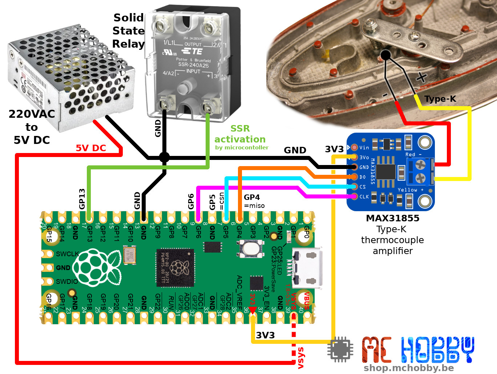

# Plancha-Cms : créer une plaque de refusion CMS contrôlée avec MicroPython

Le projet Plancha-Cms à pour but de créer un four / plaque de soudure CMS en utilisant une semelle de fer à repasser comme élément chauffant.

Ce projet ne réclame pas énormément d'éléments puisqu'il suffit:
* d'un élément de chauffe (fer à repasser de 2200W entièrement démonté).
* d'un dispositif de mesure de température:
 * [un thermocouple type-K](https://shop.mchobby.be/fr/temperature/301-thermocouple-type-k-3232100003019.html)
 * [amplificateur ThermoCouple (max31855)](https://shop.mchobby.be/fr/temperature/302-amplificateur-thermocouple-max31855-v20-3232100003026-adafruit.html)
* d'un [Raspberry-Pi Pico](https://shop.mchobby.be/fr/pico-rp2040/2025-pico-rp2040-microcontroleur-2-coeurs-raspberry-pi-3232100020252.html?search_query=pico&results=27) (microcontrôleur) et [Pico-Hat](https://shop.mchobby.be/fr/pico-rp2040/2037-pico-hat-r2-interface-hat-pour-raspberry-pi-pico-3232100020375.html) (prototypage).
* d'un relais SSR 240D25 (240V / 25A).
* d'une [alimentation 5V](https://shop.mchobby.be/fr/bloc-alimentation/1835-alimentation-5v-5a-decoupage-chassis-ferme-3232100018358.html) (pour l'autonomie).
* d'un __arrêt d'urgence!__

Voici le prototype de développement utilisant un Raspberry-Pi Pico fonctionnant sous MicroPython.


Concernant ce projet, vous pouvez consulter les articles suivants sur le blog de MCHobby:
* [Four CMS / Plancha CMS : montage de l'élément de chauffe (semelle du fer)](https://arduino103.blogspot.com/2021/07/four-cms-plancha-cms-montage-de.html)
* [Tous les articles concernant la Plancha-CMS](https://arduino103.blogspot.com/search?q=plancha-cms)

Ce projet sera agrémenté d'éléments complémentaires: écran OLED et une interface de commande pour le rendre complètement autonome.

Ceci fera l'objet de révision plus avancées du avancées.

# 52°C et 60°C les températures clés de sécurité
Ce projet permet portera la surface de chauffe a la température affolante de 250°C !

S'il est évident pour tous que cela est dangereux, peut d'entre-vous ne se rendrons pas vraiment compte qu'il y a déjà un __réel danger à partir de 60°C__.


* __52°C__ : point de brûlure où les tissus sont rapidement détériorés.
* __60°C__ : les protéines de la peau sont immédiatement détruites!

Imaginez ce que peut faire une platine de 2000 Watt portée à 150°C ou 250°C ?

Votre premier achat est le fer, le deuxième achat doit être l'arrêt d'urgence!

# Brancher

## Circuit de puissance
Le circuit puissance est raccordé comme suit:


## Circuit de commande

Le circuit de commande de chauffe et mesure de température est branché comme suit:



Ces raccordements sont suffisant pour tester les rampes de températures [test_ramp.py](examples/test_ramp.py) et la régulation PID [test_pid.py](examples/test-pid.py) depuis une ligne de commande REPL.

Dans un second temps, l'interface Homme-Machine est montée avec un afficheur LCD 16x2 et un encodeur rotatif + click (avec LED RGB).


## Aide au développement

Le circuit de commande est complété par un bouton Reset externe et un switch RUN_APP. Des fonctionnalités presque indispensables durant une phase de développement.

Le switch placé sur la position STOP permettra d'arrêter le programme --ou-- d'empêcher celui-ci de démarrer après un Reset.

Le Reset externe permettra de redémarrer rapidement le Pico (Note: le fichier boot.py doit impérativement désactiver le relai SSR pour désactiver une éventuelle chauffe).

Voici le raccordement des deux éléments:


## Circuit de refroidissement

Le circuit de refroidissement est composé de 2 ventilateurs 12V qui ventilent le dessous de la semelle pour la refroidir plus rapidement.


Les ventilateurs 12V étant pilotés par un Transistor MosFet (surdimensionné dans ce cas), l'usage d'un Mosfet-Driver (IX4428) a été nécessaire pour permettre le pilotage des ventilateurs depuis un signal 3.3V.

Un régulateur Step-up LM2577 est utilisé pour produire la tension 12V requise par les ventilateurs.

La capacité de 470uF permet de réguler le courant dans le circuit 12V et évite un effet de pompe (marches/arrêts ininterrompu) sur les ventilateurs.  

# Thermocouple

La lecture de la température est un élément crucial de ce projet. Cette opération doit être rapide, précise et fiable.

C'est pour cela qu'un thermocouple Type-K est placé sous la semelle du fer pour en mesurer la température. Celui-ci est couplé à un amplificateur thermocouple MAX31855 permettant d'acquérir la température via un bus SPI.


Le thermocouple est maintenu en place à l'aide d'une vis et d'un ressort. Une boulette de Kapton est placée entre la tête de vis (hexagonale) et le thermocouple.

Le script de test [test_max31855.py](example/test_max31855.py) permet de vérifier le bon fonctionnement de celui-ci!

# Contrôle en "PWM Low Frequency"

Pour pouvoir utiliser un régulateur PID, il est nécessaire de pouvoir faire varier l'un des paramètres d'entrée du système: le temps de chauffe de la semelle.

L'approches la plus conventionnelle est d'utiliser un signal PWM avec un cycle utile de 0 à 100% __sauf qu'une fréquence PWM de 500 Hz est incompatible avec l'usage d'un relais SSR__ (Solid State Relay).

La bibliothèque [lib/lfpwm.py](lfpwm.py) à permis de créer un signal PWM avec une période de 1.5 sec (soit une fréquence PWM de 0.666 Hz) dont il est possible de commander le cycle utile entre 0 et 100%.

Cela à permit de réaliser des test de chauffes jusqu'à la température de consigne différents cycles utiles à l'aide du script [test_ramp.py](examples/test_ramp.py) .


Les résultats graphiques (et feuilles de calculs) de ces tests sont disponibles dans l'archive [docs/test-ramp.zip](docs/test-ramp.zip) .

# Les constantes PID

Pour que ce projet puisse fonctionner correctement, il est primordial d'identifier
les constantes Kp (proportionnel), Ki (integrale), Kd (dérivé) du régulateur
PID contrôlant la chauffe du semelle du fer.

Le script [test_pid.py](examples/test_pid.py) permet de réaliser un simple test
de chauffe jusqu'à la consigne (généralement 150°C) puis de maintenir celle-ci. Cela permet de vérifier l'adéquation des constantes Kp, Ki et Kd choisies.

__Remarque:__

Si vous ne savez pas ce qu'est une régulation PID, je vous propose de regarder la
vidéo "[PID Controler with Arduino](https://youtu.be/k7vxUFVR8Ks)" d'Andeas Spiess (_anglais_)
qui explique comment identifier la valeur des constantes à utiliser.


Le processus d'identification des constantes assez long et même fastidieux
puisqu'il faut attendre le refroidissement de la semelle entre deux essais.

Ce processus aura prit pas moins de __20 itérations__ pour trouver les constantes
adéquates.

Les premiers essais pour atteindre 150°C montraient un dépassement important
allant jusqu'à 170°C (situation inacceptable dans le cadre d'une refusion CMS).


En fin d'itérations, le système est plus lent... mais sans aucun dépassement
comme le démontre ce test de régulation à 175°C.


Les constantes PID de ma plancha sont donc:

```
Kp=1.95, Ki=0.0125, Kd=4.5
```

Ces itérations sont disponibles sous formes de feuilles de calculs et graphiques (les graphiques reprennent les constantes Kp, Ki, Kd utilisées) dans l'archive [docs/test-pid.zip](docs/test-pid.zip) .
